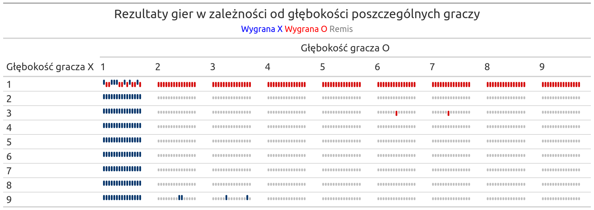
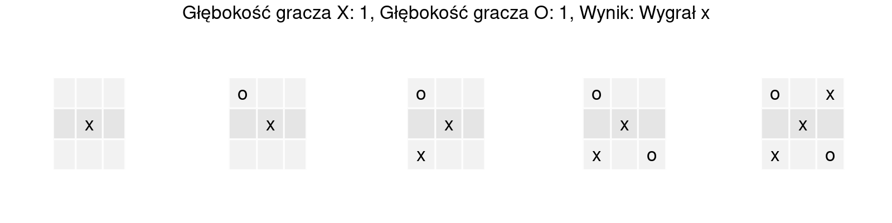
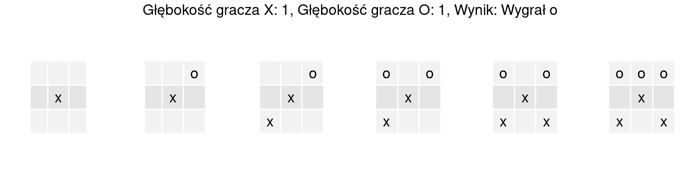
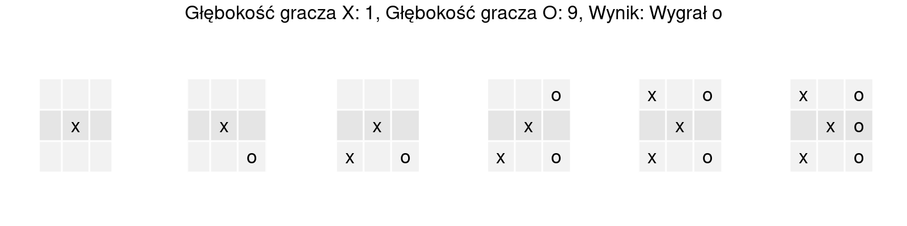
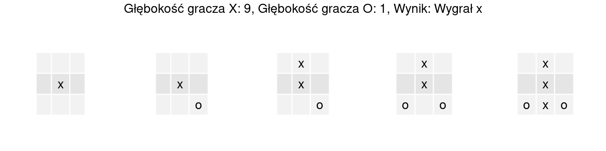
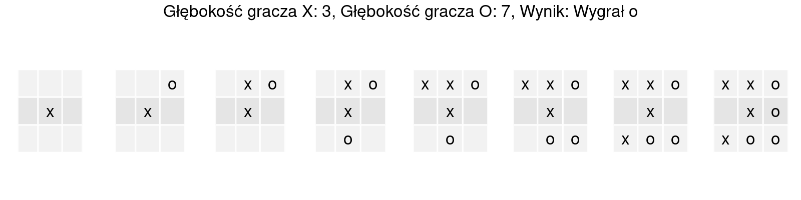
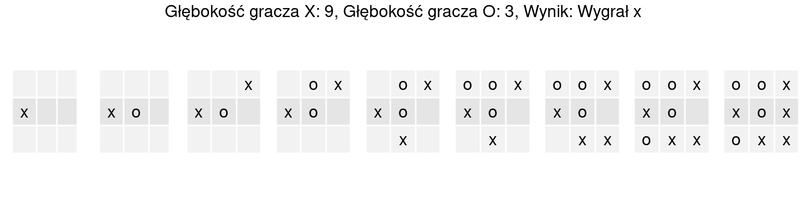
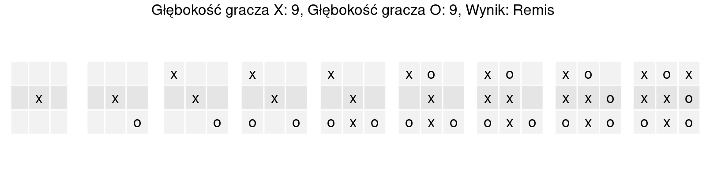
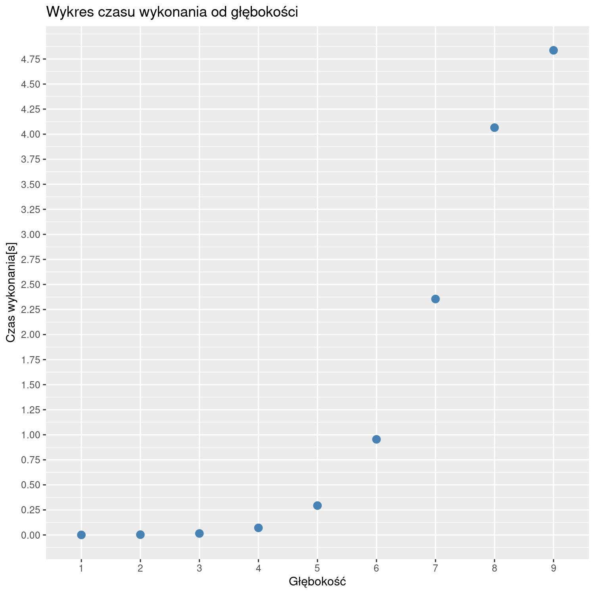

# Algorytm Min-Max na przykładzie gry w kółko i krzyżyk
## Mikołaj Szawerda 318731

# Opis polecenia

Zadanie polega na zaimplementowaniu terminalowej wersji gry w kółko i krzyżyk na planszy 3X3.
Kolejne ruchy każdego z graczy są generowane przez algorytm MiniMax.
Algorytm polega na generowaniu możliwych stanów gry o x ruchów w przód,
a następnie oceny każdej z ścieżek przy pomocy funkcji heurystycznej
(w przypadku braku dotarcia do stanu terminalnego) lub funkcji wypłaty
(w przeciwnym wypadku(wygrywa x, lub o lub remis)) z założeniem wybrania przez graczy
optymalizujących wyborów.

W mojej implementacji wykorzystałem zaproponowaną na wykładzie funkcję heurystyczną z wykorzystaniem macierzy

| | | |
|-|-|-|
|3|2|3|
|2|4|2|
|3|2|3|

Macierz obrazuje w ilu konfiguracjach potencjalnie bierze udział dane pole. Funkcja heurystyczna to suma poszczególnych wartości macierzy razy odpowiednio (1 - dla gracza max, 0 dla pustego pola, -1 dla gracza min)

Ponieważ istnieje możliwość, że parę pól uzyska najlepszą etykietę, w mojej implementacji z puli pól maksymalnych jest losowo wybierane jedno - zwiększa to różnorodność gry i w przypadku mniejszych głębokości zwiększa szanse na wygraną.

# Planowane eksperymenty numeryczne

Algorytm minimax zostanie uruchomiony dla każdej kombinacji głębokości poszukiwań obu graczy z zakresu <1,9> (gdzie 1 oznacza wygenerowanie przyszłego ruchu i ocenę przez funkcję heurystyczną)

Ponieważ występuje element losowy, gra zostanie wykonana 15 razy dla każdej kombinacji.

Pomiarowi podlega również średni czas wykonania się programu w zależności od głębokości(w tym przypadku zaprezentowane zostaną wyniki dla głębokości graczy równych sobie).

Przyjmuję, że gracz grający symbolem X zaczyna pierwszy.

# Wyniki

## Rezultaty uruchomień

Dla głębokości obu graczy = 1 nie widać 100% przewagi jednego z graczy. Jest to spowodowane niemożnością przewidzenia przez gracza ruchu przeciwnika, który kończy grę - natychmiast po wygenerowaniu możliwych ruchów jest liczona funkcja heurystyczna, która nie zawiera informacji o możliwym przyszłym stanie terminalnym.
W przypadku, gdy głębokość jednego z gracza = 1, a drugiego != 1 występuje 100% przewaga danego gracza - gracz, który ma możliwość zobaczenia większej ilości potencjalnych ruchów przeciwnika, może go zablokować, jednocześnie zapewniając sobie wygraną w przyszłym ruchu.
Gdy głębokość obu graczy jest >=2 gra praktycznie zawsze kończy się remisem.

## Wizualizacja przykładowych gier

Widać, że w każdej z gier gracze nie zauważyli przyszłego stanu terminalnego.

Graczowi O udało się zastawić pułapkę - w 7. ruchu nie ważne gdzie zagrałby X, O i tak wygra.

W podobny sposób graczowi X udało się zastawić pułapkę dla gracza O, jednakże warte jest spostrzeżenia iż gracz wymagał do tego możliwości maksymalnej głębokości przeszukiwań.

Większość gier kończyła się remisem, ponieważ każdy z graczy był w stanie odpowiednio wcześnie zablokować przyszłe potencjalnie wygrywające ruchy przeciwnika.

W prawie każdej z gier można zaobserwować, że najbardziej opłacalnym ruchem na początku jest środek(wynika to z przyjętej funkcji heurystycznej).

## Średni czas wykonania

Można zaobserwować złożoność wykładniczą algorytmu minmax - w mojej implementacji nie występują możliwe optymalizacji w postaci cache'owania już raz policzonych ewaluacji stanów, implementacji iteracyjnej, lub wariantu alpha-beta algorytmu.

# Wnioski

Z przeprowadzonych eksperymentów wynika, iż w grę kółko i krzyżyk najłatwiej jest zremisować - kiedy gracze nawzajem się blokują blisko przyszłych stanów terminalnych. Jedyną możliwością wygranej drugiej strony jest niezauważenie przyszłego stanu terminalnego, lub doprowadzenie do sytuacji w której dwa możliwe ruchy kończą grę.

Eksperymenty pokazały również, że wystarczy iż gracze potrafią ocenić dwa ruchy w przyszłość, by z prawie 100% pewnością zremisować.

Wyróżniającym się rezultatem są wyniki, gdzie głębokość 1. gracza = 3, natomiast 2. gracza > 6.
W niektórych grach gracz 2. znajdował pułapkę, w której w następnym ruchu istniały dwa stany terminalne - gracz 1. nie widział tego przez swoją niższą głębokość, a jednocześnie gracz 2. był wstanie przeszukać odpowiedni stan. Podobnie dla gracza 1 gdy głębokość wynosiła 9, a dla gracza 2. 2,3 gracz 1. był w stanie odpowiednio zastawić pułapkę, a gracz 2. nie był w stanie przewidzieć możliwych dwóch stanów terminalnych.

