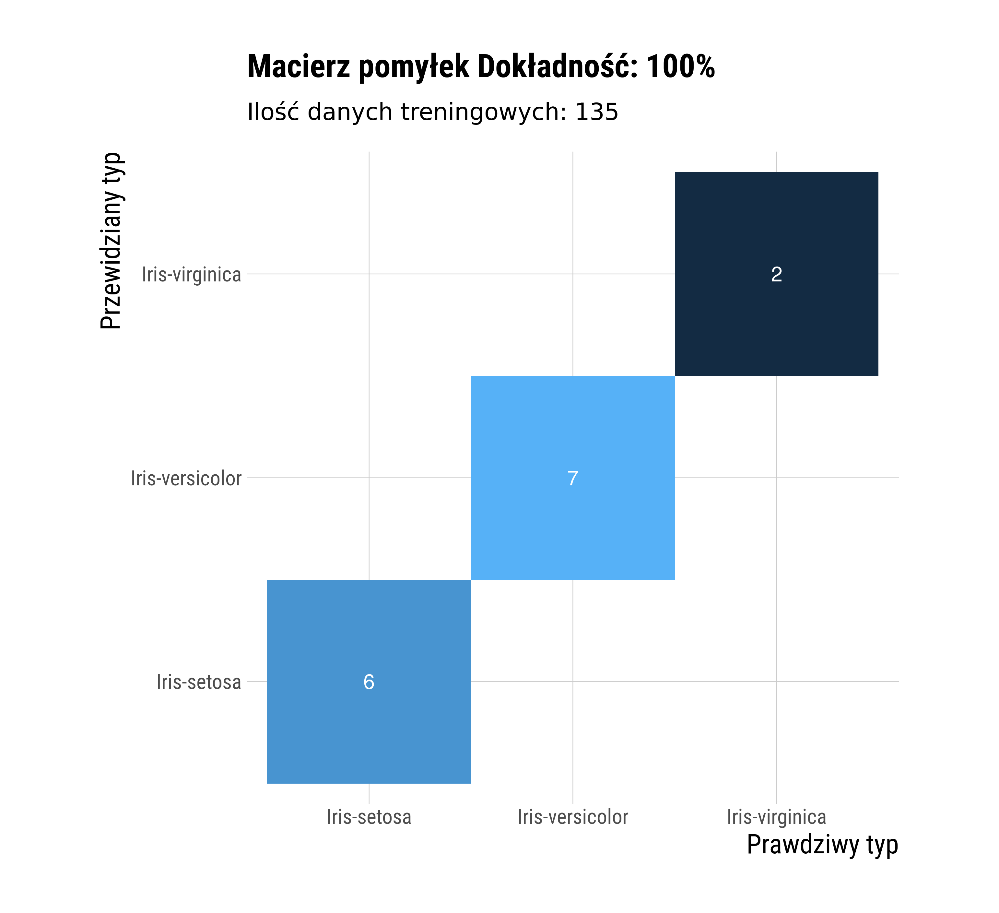

# Naiwny Klasyfikator Bayesowski
## Mikołaj Szawerda 318731
# Opis polecenia

Zadanie polega na zaimplementowaniu nawinego klasyfikatora Bayesowskiego
oraz zbadaniu jego działania w zastosowaniu do zbioru danych Iris Data Set. Działanie klasyfikatora polega na przypoprządkowaniu prawdopodobieństwa
przynależności do klas dla danego zestawu wartości cech i wybraniu tego
o największej wartości.Prawdopodobieństwo jest wyliczane z założeniem warunkowej niezależności cech - jest
więc iloczynem prawdopodobieństw dla każdej cechy. Ponieważ cechy są typu ciągłego, oraz po przeprowadzeniu analizy rozkładu wartości,
do wyliczenia potrzebnych wartości użyję gęstości rozkładu normalnego.

Algorytm realizuje następujący wzór:

gdzie

,

$p(C_k)$ - prawdopodobieństwo klasy, zostało wyznaczone na podstawie liczności w zbiorze treningowym

Trening polega więc na wyznaczeniu $\mu_k$ i $\sigma^{2}_k$ dla każdej klasy i cechy z zbioru uczącego, a predykcja polega na wyliczeniu wartości dla każdej z możliwych klas i wybraniu tej najbardziej prawdopodobnej.

# Planowane eksperymenty numeryczne

Przeprowadzę klasyfikację dla zbioru testowego, dla wytrenowanego klasyfikatora odpowiednio dla
10%,...,90% dostępnych danych jako zbiór uczący, oraz zbadam osiągniętą dokładność.

# Wyniki

Można zauważyć, że praktycznie każda z cech ma w przybliżeniu rozkład normalny - przyjęcie gestości rozkładu normalnego ma więc swoje uzasadnienie.
Można również zauważyć, że klasa "Iris-setosa" znacząco różni się od pozostałych dwóch, co może sugerować lepsze osiągi klasyfikacji dla tej klasy.

Wraz z ilością danych treningowych rośnie dokładność klasyfikacji - od stosunku $\frac{2}{3}$ danych treninogowych do testowych klasyfikator osiąga nieomylność

Pomyłki występują tylko pomiędzy klasami "Iris-virginica" i "Iris-versicolor" - co można było przewidzieć na podstawie wartości średniej i wariancji cech

Spadek czasu wykonania wraz z ilością danych treningowych wynika z wzrostu ilości danych testowych. Można zauważyć liniowy charakter algorytmu.

# Wnioski

Naiwny klasyfikator Bayesowski dla zadanego zbioru
danych osiągnął prawidłowe rezultaty. Należy zwrócić uwagę na potrzebną ilość danych do rozpoczęcia zwracania przez algorytm pożądanych rezultatów - już dla zbioru 15 przykładów algorytm osiągnął 93% dokładność. Fakt ten można wytłumaczyć normalnym rozkładem wartości cech, przez co wyliczone przybliżone prawdopodobieństwa przynależności były bliskie wartościom teoretycznym.

Przypadki w których algorytm dokonywał błędnej klasyfikacji są związane z podobnym rozkładem cech pomiędzy klasami - jednakże w raz z odpowiednią ilością danych błąd ten w najlepszych próbach osiągnął 0.

Złożoność czasowa algorytmu jest liniowa, natomiast w czasie wykonania algorytm potrzebuje tylko tablicy wartości średniej i wariancji dla każdej kombinacji klasa-cecha

