# Zadanie 6 Q-Learning
## Mikołaj Szawerda 318731

# Opis polecenia

Zadanie polegało na zaimplementowaniu algorytmu Q-learning, oraz przeprowadzaniu wpływu hiperparametrów - w szczególności współczynnika uczenia - na działanie algorytmu na przykładzie środowiska Taxi.

Algorytm Q polega na sukcesywnej aktualizacji tablicy przechowującej informację o najbardziej opłacalnym ruchu(akcji) w zależności od obecnego stanu według wzoru:

$Q_{t+1}=Q_t+\beta(r_t+\gamma \space argmax(Q_t(x_{t+1}, a)-Q_t(x_t, a_t)))$, gdzie

$\gamma$ - współczynnik dyskontowania

$\beta$ - współczynnik uczenia

$x_t$ - stan w którym obecnie znajduje się agent

Uczenia składa się z epizodów, podczas których agent otrzymuje $t_{max}$ - maksymalną ilość iteracji na dojście do stanu terminalnego.
Podczas trwania epizodu agent przechodzi po możliwej przestrzeni stanów,  a w każdej iteracji wybiera akcję, którą ma wykonać według przyjętej strategii.
Strategia wyznacza balans pomiędzy eksploracją - zbadanie możliwie jak największej ilości stanów, a eksploatacją - jak najlepsze oszacowanie wartości Q, dla danej akcji i stanu.

W rozwiązaniu zbadałem trzy strategie:
- $\epsilon$-zachłanną - z prawdopodobieństwem $\epsilon$ wybierana jest akcja losowa, z $1-\epsilon$ akcja o maksymalnej wartości Q
- Boltzmana - dla danego stanu prawdopodobieństwo wybrania akcji dane jest wzorem: $\frac{e^{\frac{Q(x, a)}{T}}}{\sum e^{\frac{Q(x)}{T}}}$ - z większym prawdopodobieństwem wybrana jest akcja o maksymalnej wartości
- Licznikowa - w mojej implementacji stanowi modyfikację $\epsilon$-zachłannej, jest zamiennikiem wyboru losowego - prawdopodobieństwo wyboru akcji jest odwrotnie proporcjonalne to ilości użyć akcji

Hiperparametry algorytmu Q: $\beta$, $\gamma$, $t_{max}$, strategia wyboru akcji, parametry strategii

# Planowane eksperymenty numeryczne

W eksperymentach przyjąłem stałe wartości: $t_{max}=30$, $ilość \space epizodów=5000$

Eksperymenty zostały wykonane dla kombinacji:
- $\gamma \in \{ 0.1, 1.0  \}$ (współczynnik dyskontowania)
- $\beta \in \{ 0.1, 0.4, 0.7, 1.0 \}$ (współczynnik uczenia)
- $strategia \in \{ epsilon, boltzman, counter \}$
- $parametr \space strategii \in \{ 0.1, 1.0 \}$

Uruchomienia będą porównywane na podstawie:
- rozkładu nagrody z 1000 uruchomień po wytrenowaniu
- min/max nagrody z 10 uruchomień w zależności od iteracji
- czasu wykonania

# Wyniki

(Ujemna nagroda oznacza, że agent wpadł w pętlę i nie udało mu się osiągnąć stanu terminalnego)

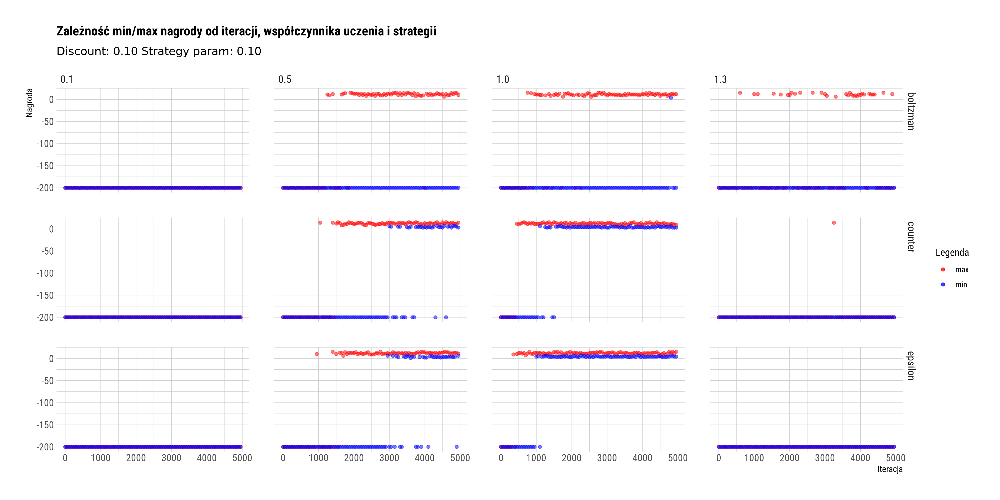

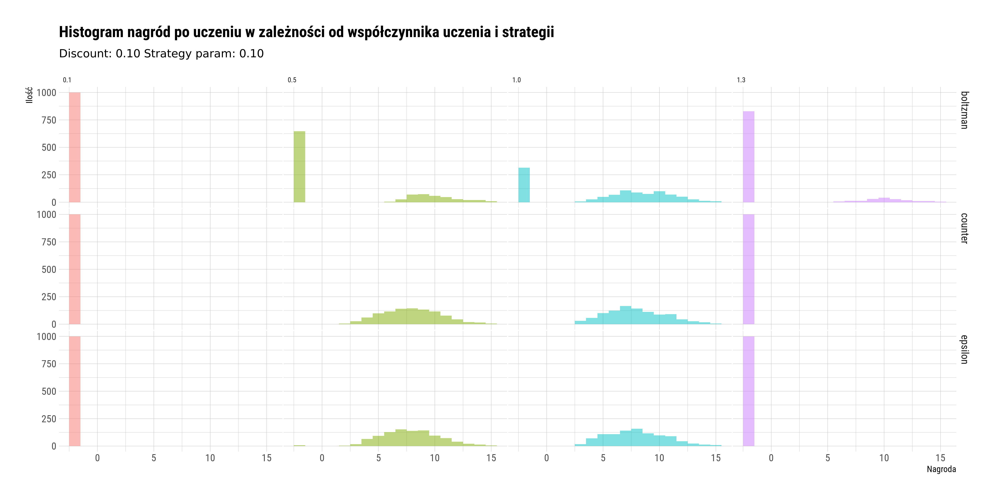

W raz z wzrostem parametru uczenia maksymalnym rezultatem epizodu jest dodatnia nagroda, a w przypadku strategii licznikowej i epsilonowej dochodzi do braku pomyłek i agent w każdym przypadku dochodzi do stanu terminalnego. Za duży learning rate(>1.0) prowadzi do negatywnych rezultatów dla strategii licznikowej i epsilonowej. W przypadku strategii boltzmana learning rate nie ma aż tak drastycznego znaczenia. Dla parametru strategii 0.1 nie widać znaczącej różnicy pomiędzy strategią licznikową, a epsilonową.

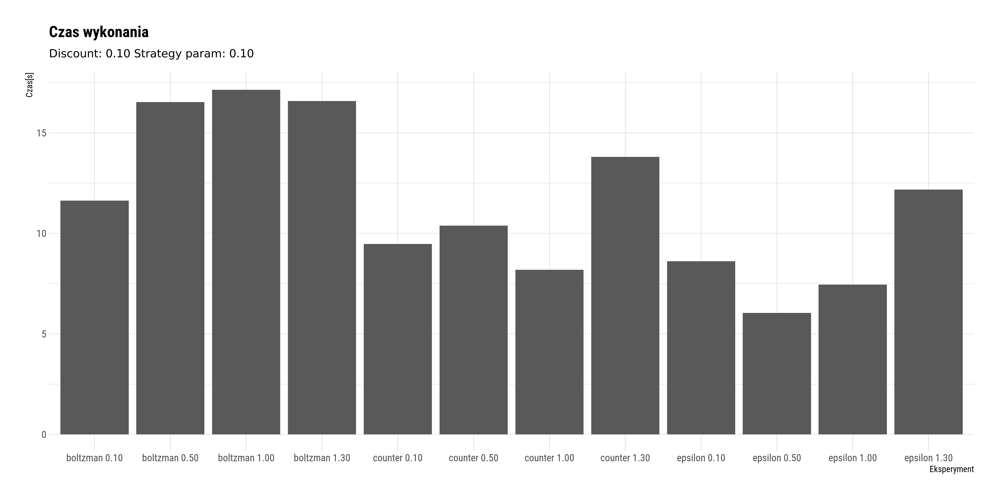

Strategia boltzmana wiąże się z większym narzutem obliczeniowym - odpowiednie przekształcenie Q wartości dla danego stanu, przy wyborze.

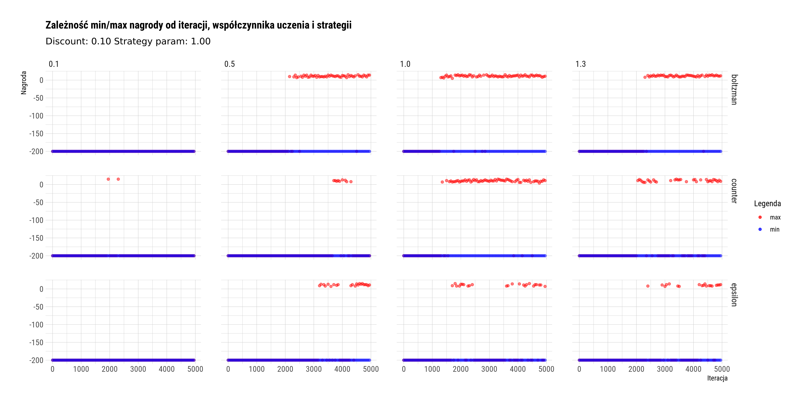

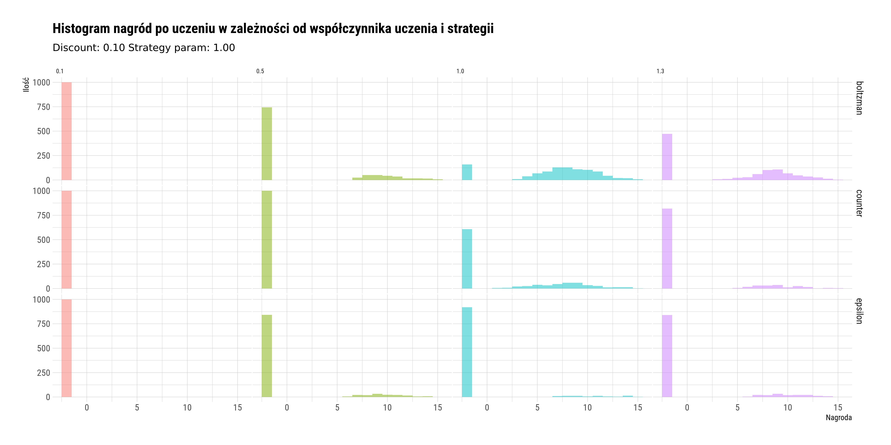

Dla parametru strategii 1.0 strategia epsilonowa staje się strategią losową - licznikowa z heursytką stochastyczną wybierania najrzadziej ewaluowanego osiąga lepsze rezultaty. Strategia bolztmana dla większego parametru strategii osiąga lepsze rezultaty - staję się lepszym wyważeniem pomiędzy eksploracją a eksploatacją

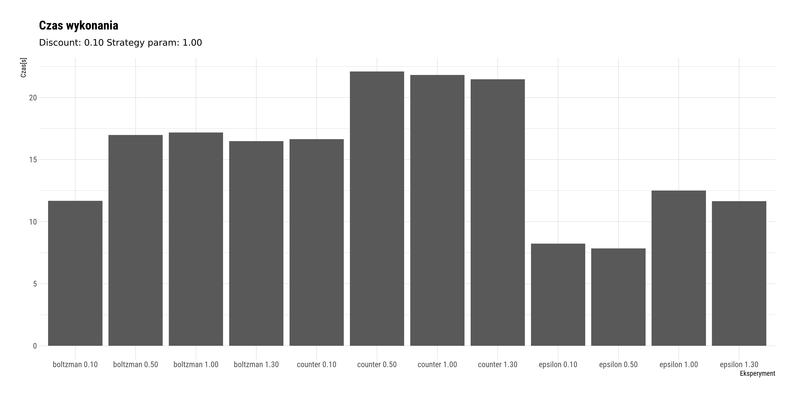

Strategia epsilonowa wykonuje się najszybciej ponieważ z wyborem akcji nie jest związany dodatkowy narzut obliczeniowy.

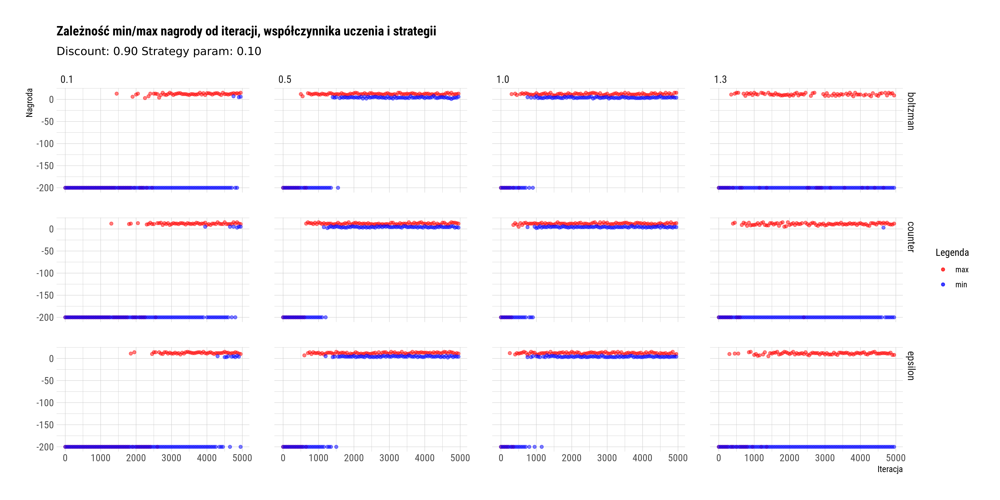

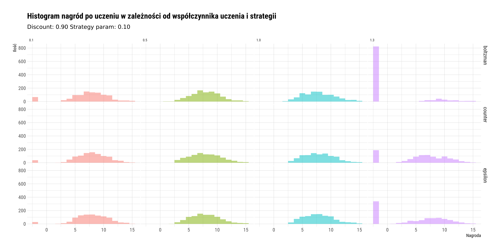

Przy zwiększeniu współczynnika dyskontowania algorytmy osiągają najlepsze rezultaty. Każdy z algorytmów dla wystarczająco dobranego współczynnika uczenia już po 1000 epizodów osiąga dodatnią minimalną nagrodę. Przy odpowiednio dobranych hiperparametrach można zauważyć nie aż tak znaczący wpływ współczynnika uczenia, również różnice pomiędzy strategiami są zatarte.

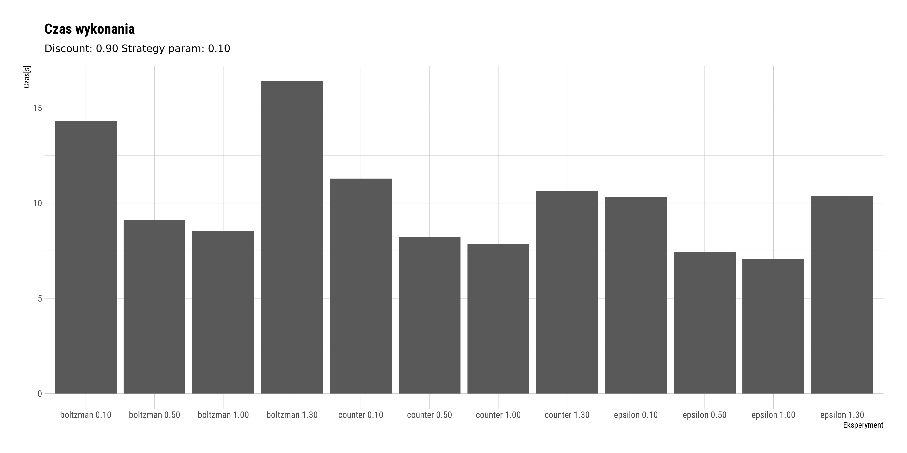

Algorytmy z dobrze dobranymi hiperparametrami mają mniejszy czas wykonania - agenci bliżej końca treningu szybciej dochodzą do stanów terminalnych

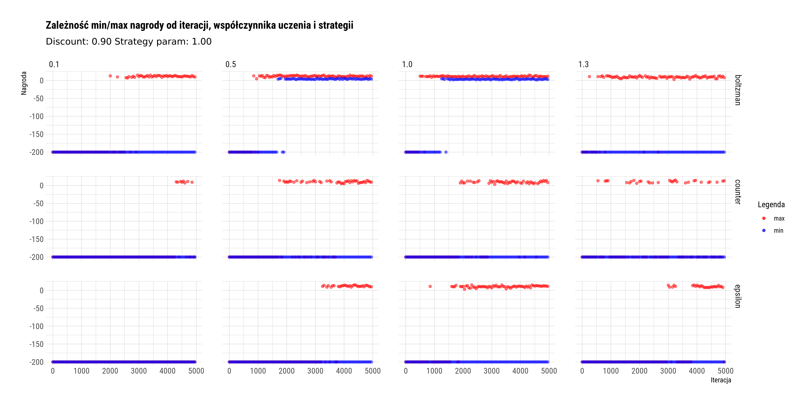

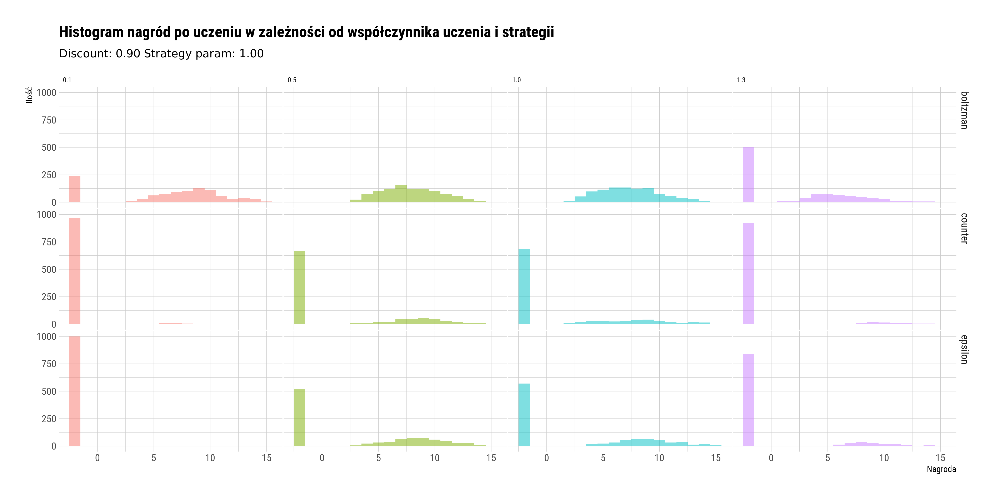

W przypadku strategii epsilonowej i licznikowej pomimo dobrego współczynnika dyskontowania algorytmy przestały działać prawidłowo, strategia boltzmana jest znacząco lepsza. W przeciwieństwie, gdy współczynnik dyskontowania był niepoprawnie dobrany, strategia epsilonowa radzi sobie lepiej od licznikowej.

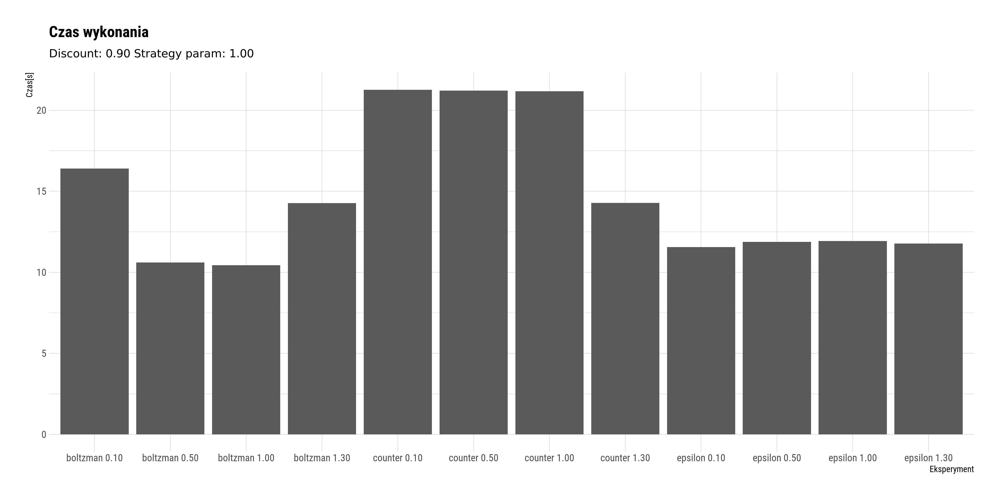

Czas wykonania strategii licznikowej jest największy, co prowadzi do konkluzji, iż sama strategia licznikowa jest mało użyteczna(w tym problemie).

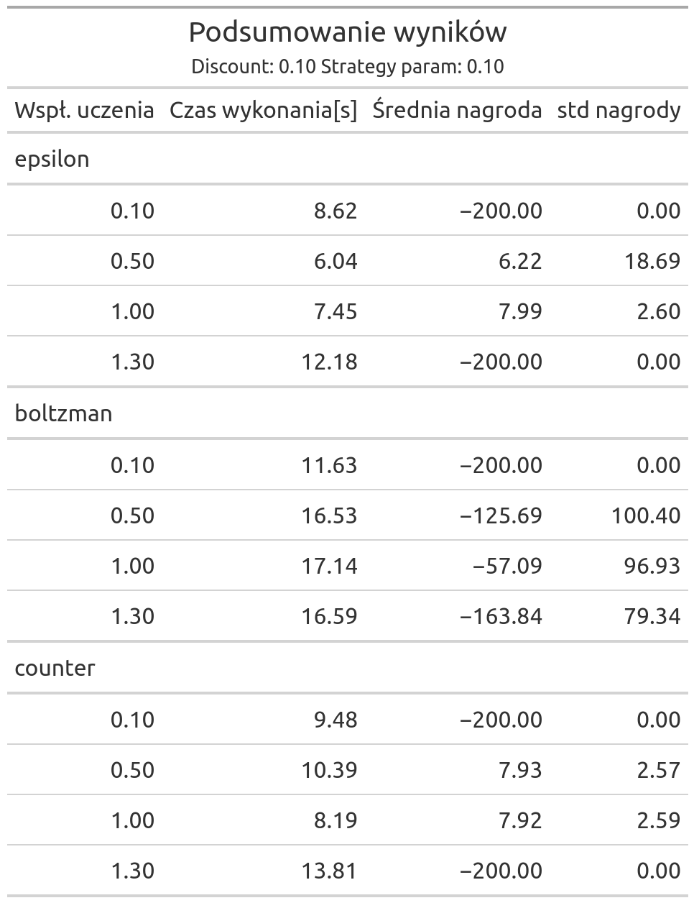
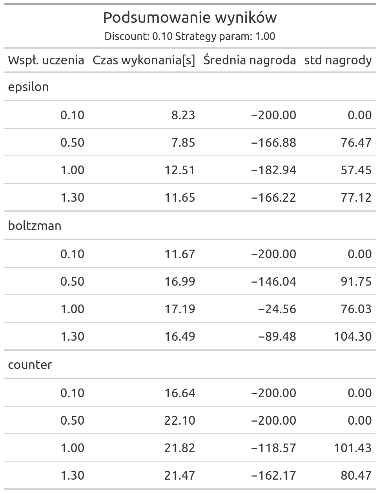
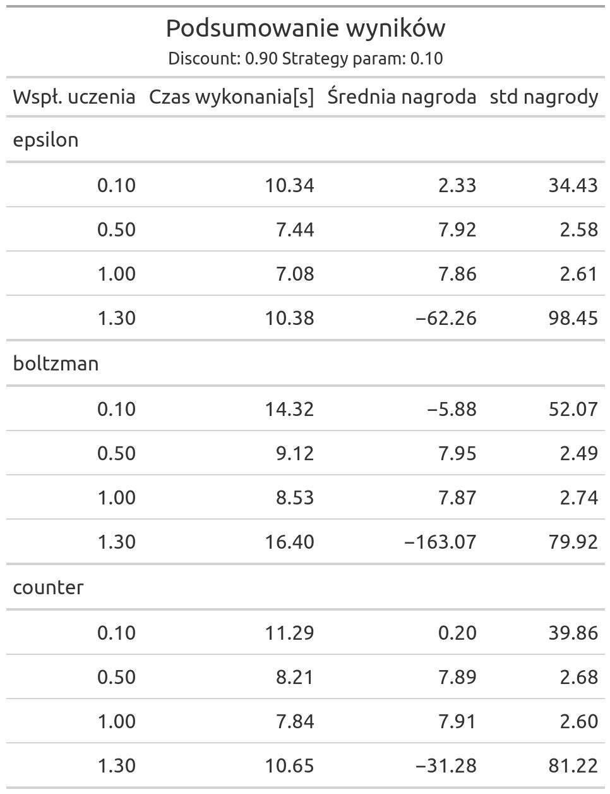
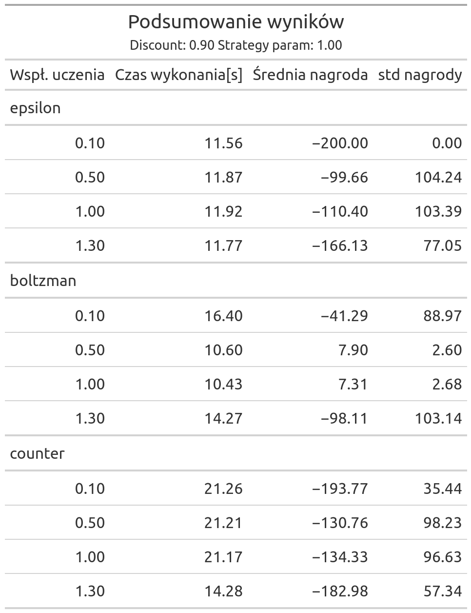

# Wnioski

- W przypadku źle dobranych innych hiperparametrów współczynnik uczenia ma kluczowe znaczenie przy działaniu algorytmu - im bliższy 1.0 tym lepszy. Ma na to wpływ deterministyczny charakter środowiska, każdy z stanów jednoznacznie wyznacza możliwe stany przyszłe i każde z przejść może być tak samo prawdopodobne, więc estymowana poprawa Q wartości jest prawidłowa.

- Dla dobrze dobranych hiperparametrów współczynnik uczenia(odpowiednio wysoki) miał mniejszy wpływ na prawidłowość działania algorytmów - zmniejszał czas wykonania.

- W każdym z przypadków testowych za duży jak i za mały współczynnik uczenia prowadził do braku, lub w znaczącej części braku osiągania stanu terminalnego.

- Strategia boltzmana przy mniejszym współczynniku dyskontowania była lepsza od pozostałych - jej wyważenie eksploracji i eksploatacji pozwoliło lepiej przeszukać przestrzeń.

- Modyfikacja strategii epsilonowej o strategię licznikową nie przyniosła znaczącej poprawy działania algorytmu, w niektórych doprowadziła do pogorszenia, oraz dodała narzut dodatkowy pamięciowy i obliczeniowy.

- Nie aż tak znaczący wpływ przyjętej strategii na rezultaty może mieć determinizm środowiska. W każdym z stanów akcja najlepsza ze względu na Q wartość, będzie zawsze najlepsza - nie istnieje prawdopodobieństwo przejścia pomiędzy stanami.

