# Algorytmy ewolucyjne
## Mikołaj Szawerda 318731

## Opis polecenia

Zadanie polega na zaprojektowaniu i zaimplementowaniu algorytmu ewolucyjnego,
oraz sprawdzeniu jego zbieżności na podstawie funkcji F1, F9 z benchmarku CEC2017.

Algorytmy ewolucyjne polegają na sukcesywnym polepszaniu rezultatu,
po przez losowe zaburzanie obecnych najlepszych rozwiązań. Każda iteracja algorytmu składa się z etapów:
- reprodukcji - wybieranie osobników do rozważania w obecnej iteracji z osobników z poprzedniej. Możliwe podejścia:
  - turniejowe - są wybierane pary osobników, a z każdej pary jest wybierany najlepszy
  - ruletkowa - osobniki najlepsze mają większą szansę być wybrane
  - losowanie ze zwracaniem
- operacji genetycznych
  - mutacji - cechy osobników są losowo zaburzane
  - krzyżowania - z obecnej populacji są wybierani "rodzice", a z kombinacji ich cech jest tworzony nowy osobnik
    - jednolite - każda cecha jest brana od losowo wybranego rodzica
    - uśredniające - potomek stanowi średnią ważoną cech rodziców
- selekcja - osobniki najlepsze są wybierane do nowej populacji
  - elitarna - do nowej populacji mogą również wejść osobniki z obecnej
  - nieelitarna - tylko osobniki po operacjach genetycznych mogą wejść w skład nowej populacji

W zadaniu rozważam dwa możliwe podejścia zaimplementowania algorytmu ewolucyjnego:
- klasyczny - osobnik składa się z jednego chromosomu - wektora argumentów funkcji, reprodukcja turniejowa/ruletkowa, mutacja z parametrem sigma, krzyżowanie i selekcja
- strategia ewolucyjna - osobnik składa się z dwóch chromosomów - wektora argumentów funkcji i wektora sigm(sił mutacji), reprodukcja to losowanie ze zwracaniem, mutacja na podstawie podanej zależności matematycznej, krzyżowanie i selekcja

$a = N(0,1)$

$b_{[i]}=N(0,1), i\in 1, ..., n$

$\sigma_{[i]}\leftarrow \sigma_{[i]}e^{\tau^{'}a+\tau b_{[i]}},\tau =\frac{1}{\sqrt{2n}},\tau^{'}=\frac{1}{\sqrt{2\sqrt{2n}}} $

Każda możliwość wyboru danego etapu algorytmu wpływa na jego zdolności do eksploracji i eksploatacji. Przy pomocy doświadczeń postaram się wybrać najlepszą ich kombinację.

## Planowane eksperymenty numeryczne

Każdy eksperyment jest wykonywany wielokrotnie(100 razy) dla funkcji F1 i F9. Prezentowane są kombinacje elementów algorytmu, których wyniki się różnią. Prezentacja otrzymanych wyników składa się z:
- wykresu zbieżności(będącego średnią populacji) dla najlepszego uruchomienia,
- histogramu dla wszystkich uruchomień
- wykresu reprezentującego zróżnicowanie osobników(odchylenie std normy wektorów x populacji)
- (dla strategii e.) wykres średniej sigmy od iteracjis

### Klasyczny algorytm ewolucyjny:

<table><thead><tr><th>f</th><th>nazwa</th><th>reprodukcja</th><th>krzyżowanie</th><th>selekcja </th><th>sigma</th></tr></thead><tbody><tr><td rowspan="5">f1</td><td>RMEB</td><td>ruletkowa</td><td>uśredniające</td><td>elitarna</td><td>1e-4</td></tr><tr><td>RMEW</td><td>ruletkowa</td><td>uśredniające</td><td>elitarna</td><td>0.5</td></tr><tr><td>TUEB</td><td>turniejowa</td><td>jednolite</td><td>elitarna</td><td>0.5</td></tr><tr><td>TUEW</td><td>turniejowa</td><td>jednolite</td><td>elitarna</td><td>1e-4</td></tr><tr><td>TNNB</td><td>turniejowa</td><td>brak</td><td>nieelitarna</td><td>0.5</td></tr><tr><td rowspan="4">f9</td><td>RMEB</td><td>ruletkowa</td><td>uśredniające</td><td>elitarna</td><td>1e-4</td></tr><tr><td>TUNB</td><td>turniejowa</td><td>jednolite</td><td>nieelitarna</td><td>0.5</td></tr><tr><td>TUEB</td><td>turniejowa</td><td>jednolite</td><td>elitarna</td><td>2.5</td></tr><tr><td>TUEW</td><td>turniejowa</td><td>jednolite</td><td>elitarna</td><td>7.0</td></tr></tbody></table>

### Strategia ewolucyjna
<table><thead><tr><th>f</th><th>nazwa</th><th>krzyżowanie</th><th>µ</th><th>λ</th><th>typ</th></tr></thead><tbody><tr><td rowspan="5">f1</td><td>MPB</td><td>uśredniające</td><td>100</td><td>700</td><td>µ+λ</td></tr><tr><td>UPB</td><td>jednolite</td><td>100</td><td>700</td><td>µ+λ</td></tr><tr><td>UCB</td><td>jednolite</td><td>100</td><td>700</td><td>µ,λ</td></tr><tr><td>MCB</td><td>uśredniające</td><td>100</td><td>700</td><td>µ,λ</td></tr><tr><td>MCS</td><td>uśredniające</td><td>20</td><td>140</td><td>µ,λ</td></tr><tr><td rowspan="5">f9</td><td>MPB</td><td>uśredniające</td><td>100</td><td>700</td><td>µ+λ</td></tr><tr><td>UPB</td><td>jednolite</td><td>100</td><td>700</td><td>µ+λ</td></tr><tr><td>UCB</td><td>jednolite</td><td>100</td><td>700</td><td>µ,λ</td></tr><tr><td>MCB</td><td>uśredniające</td><td>100</td><td>700</td><td>µ,λ</td></tr><tr><td>MCS</td><td>uśredniające</td><td>20</td><td>140</td><td>µ,λ</td></tr></tbody></table>

- Porównanie najlepszego algorytmu strategii ewolucyjnej, klasycznej ewolucji i gradientu z backtrackiem

## Wyniki

## Klasyczny algorytm ewolucyjny

### F1
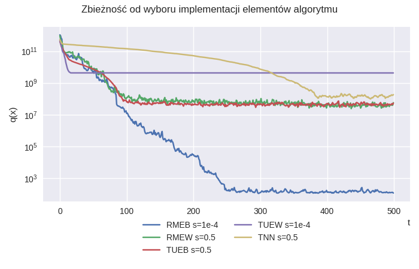

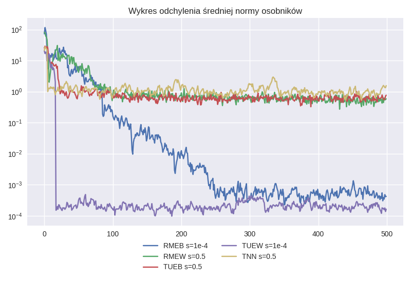

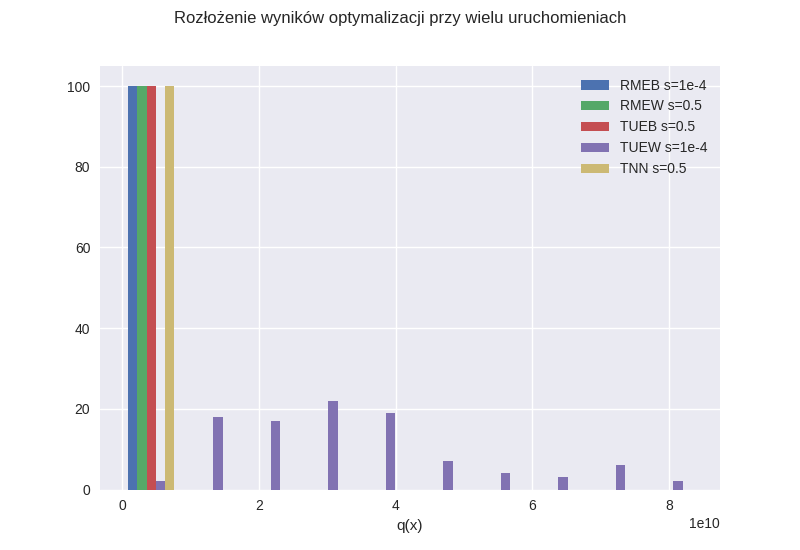

| name       |         min |         max |        mean |         std |
|:-----------|------------:|------------:|------------:|------------:|
| RME s=1e-4 |     100.986 |     91022.2 |       10154 |     16451.9 |
| RME s=0.5  | 1.02272e+06 | 6.36787e+06 | 3.38112e+06 | 1.04311e+06 |
| TUE s=0.5  | 1.21066e+06 | 6.73012e+06 | 3.50611e+06 | 1.11103e+06 |
| TNN s=0.5  | 3.22819e+06 | 5.80292e+07 | 1.48436e+07 | 7.23718e+06 |
| TUE s=1e-4 | 4.24419e+09 | 9.41593e+10 | 3.30288e+10 |   1.775e+10 |

Funkcja F1 jest funkcją jednomodalną. Nacisk w algorytmie powinien być więc na eksploatację.
Kombinacja ruletkowej reprodukcji(faworyzowanie lepszych), uśredniającego krzyżowania(skupianie populacji)
i elitarnej selekcji, oraz mała siła mutacji pozwalają algorytmowi dokładnie zbadać otoczenie punktów startowych
\- stały spadek zróżnicowania dla RME jest tego dowodem.
Z wykresu wynika również duży wpływ wyboru siły mutacji. Za duża sigma znacząco degraduje najlepszy(RME) algorytm.
Mała sigma dla algorytmu eksplorującego (TUE) prowadzi do bardzo szybkiego zmniejszenia zróżnicowania osobników i utykania algorytmu praktycznie w miejscu, prowadząc do dużego rozrzutu wartości.
Na wykresie widnieje również dowód skuteczności krzyżowania. TNN bardzo wolno optymalizuje swoje wartości, zróżnicowanie osobników jest praktycznie stałe.

### F9

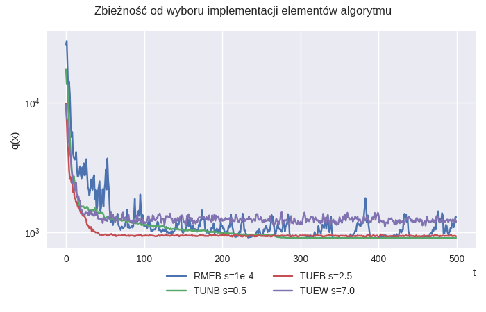

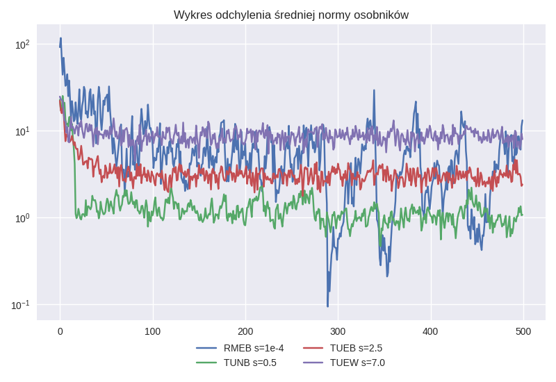

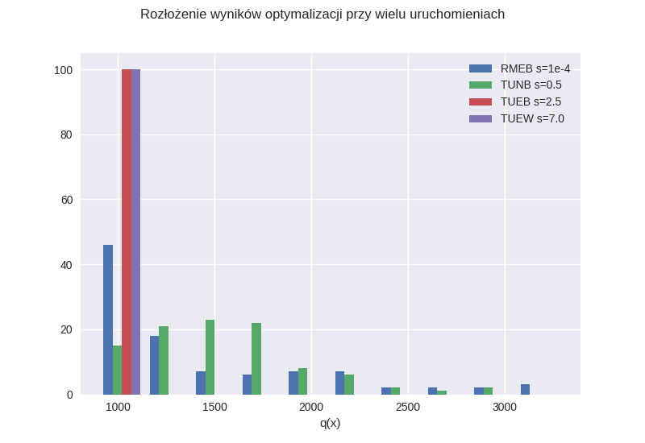

| name       |     min |     max |    mean |      std |
|:-----------|--------:|--------:|--------:|---------:|
| RME s=1e-4 | 900.069 | 3298.24 | 1445.12 |  605.592 |
| TUN s=0.5  |  900.52 | 2884.42 | 1554.96 |  420.638 |
| TUE s=2.5  |  901.12 | 904.221 |  902.74 | 0.622919 |
| TUE s=7.0  |  906.91 | 935.553 |  921.05 |  5.94816 |

Funkcja F9 jest funkcją wielomodalną. Algorytmy eksplorujące osiągnęły więc
tutaj lepsze rezultaty. TUN i TUE - algorytm turniejowy, jednolite krzyżowanie(eksploracja nawet podczas krzyżowania),
pozwoliły znaleźć szybko minimum globalne, natomiast w przypadku TUE elita pozwoliła lepiej je zeksploatować i zapewniła
mały rozrzut wyników (1000 razy mniejszy od RME). RME przez swoje zdolności do dokładniejszej optymalizacji
osiągnęło lepszy wynik, aczkolwiek rozrzut pomiędzy uruchomieniami jest największy. Za duża siła mutacji dla TUE
sprawiła iż algorytm nie potrafił odpowiednio dobrze zeksploatować.

## Strategia ewolucyjna

### F1

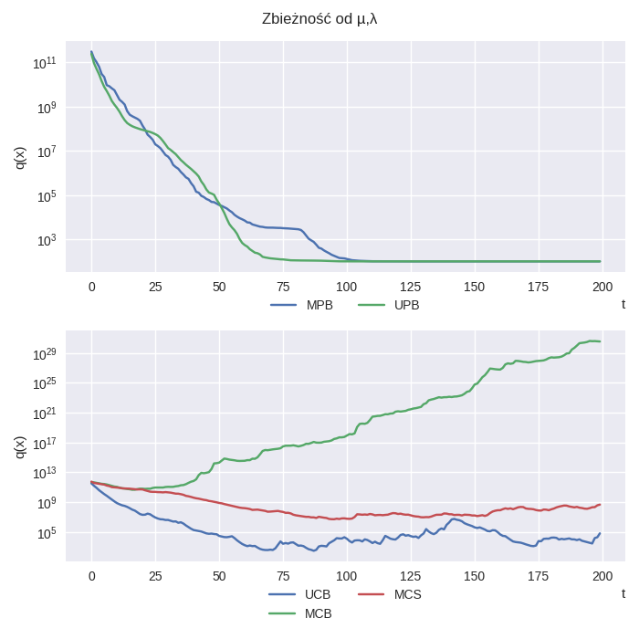

###

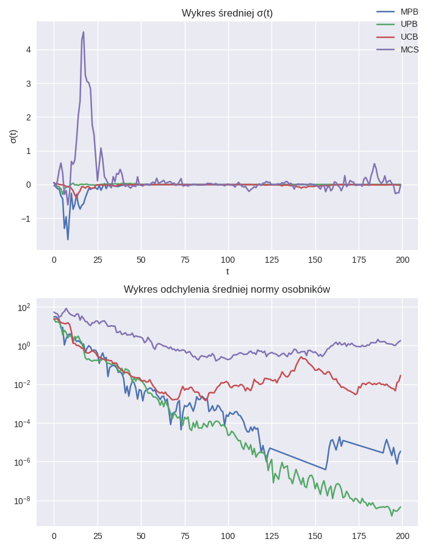

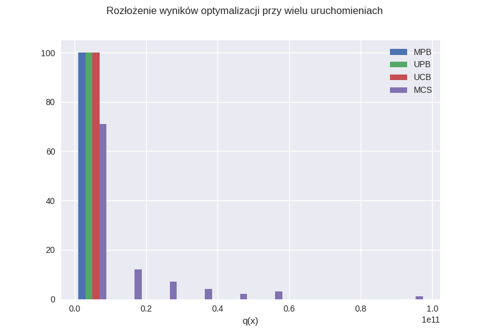

| name |         min |         max |        mean |         std |
|:-----|------------:|------------:|------------:|------------:|
| UPB  |     100.002 |     12811.8 |     2943.88 |     3078.56 |
| MPB  |     100.258 | 2.27591e+07 |      232780 |  2.2754e+06 |
| UCB  |     123.037 | 2.24423e+09 | 3.93384e+07 | 2.30182e+08 |
| MCS  | 1.79032e+06 | 9.83493e+10 | 9.60793e+09 | 1.60232e+10 |
| MCB  | 7.00301e+09 | 7.97934e+10 |  3.1793e+10 | 1.70777e+10 |

Ponieważ F1 jest jednomodalna najelpsze okazały się algorytmy bardziej "lokalne" - mi+lambda.
Jednolite krzyżowanie w UPB dodało również lepszego pokrycia przestrzeni, przez co algorytm
osiągnął małe odchylenie pomiędzy urochomieniami, a przy tym najlepszy wynik. "Ciekawy" rezultat dało
krzyżowanie uśredniające i selekcja nieelitarna - algorytm rozbiegał do inf(w przypadku dużych mi) lub
zatrzymał się przy dużych wartościach(małych mi) i osiągał ogromne odchylenie standardowe.
W każdym z algorytmów widać tendencję sigm do dążenia do 0 - przechodzenie z eksploracji do eksploatacji.
W raz kolejnymi iteracjami można również zauważyć zmniejszanie się różnorodności populacji.

### F9

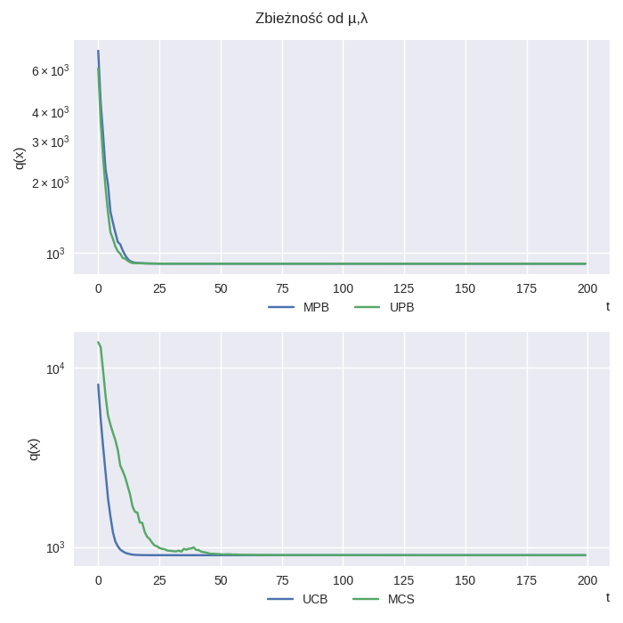

###

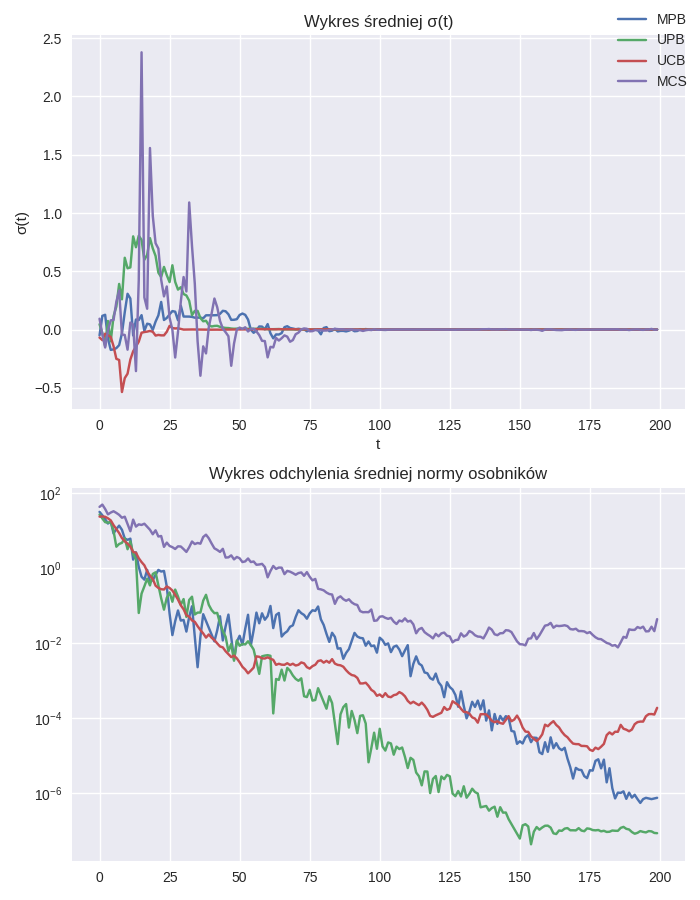

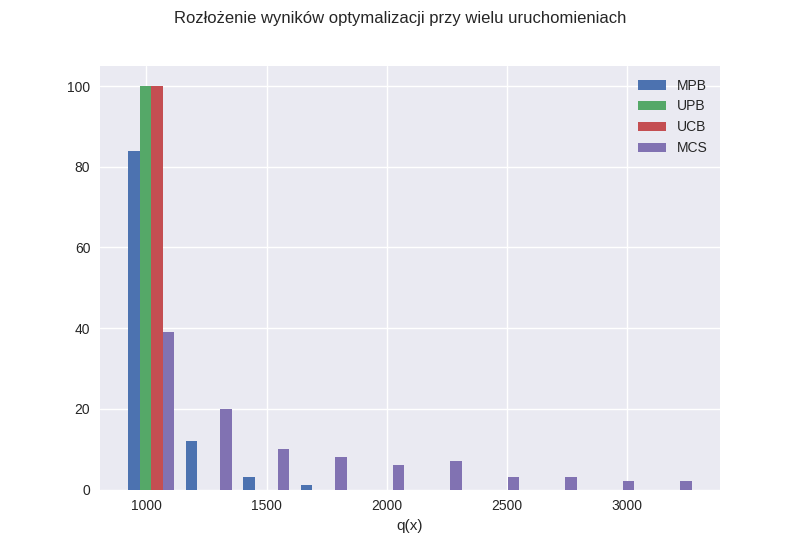

| name |     min |     max |    mean |     std |
|:-----|--------:|--------:|--------:|--------:|
| UPB  |     900 | 998.169 |  910.98 | 16.3839 |
| MPB  |     900 | 1670.95 | 991.103 | 158.961 |
| UCB  |     900 | 923.258 | 901.496 | 3.69842 |
| MCS  |     900 | 3293.46 | 1456.47 | 598.723 |
| MCB  | 1140.18 | 3176.88 | 2057.42 | 451.752 |

Dla F9 4 z algorytmów osiągnęły dokładną wartość optimum globalnego. UCB okazało się zdecywanie
najlepszym. Posiada najniższą średnią z uruchomień, odchylenie i najlepsze z uruchomień osiągnęło średnią
w 10 iteracji. W przypadku UPB można zaobserować bardzo duży spadek zróżnicowania populacji.

## Porównanie najlepszych algorytmów i gradientu

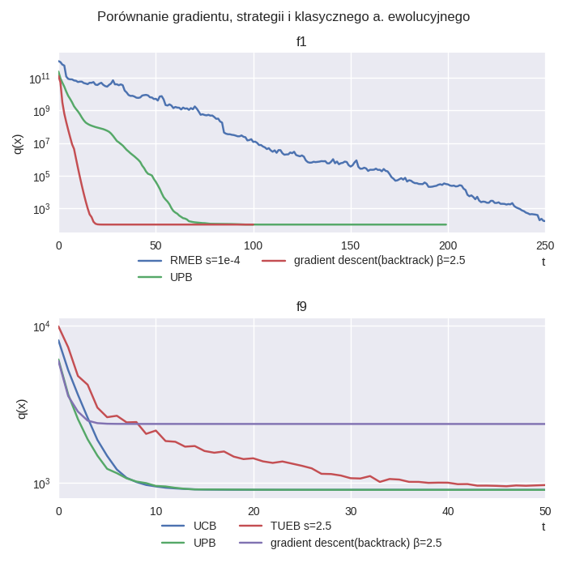

###

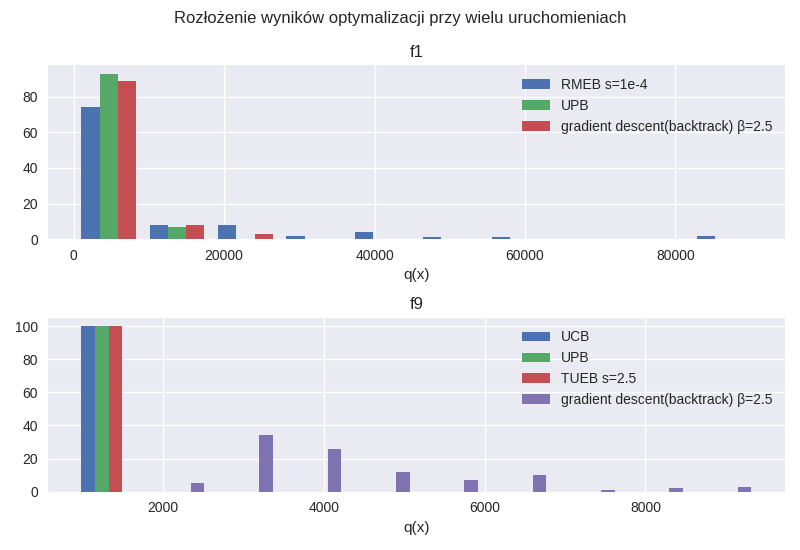

| name                              |     min |     max |    mean |     std | t_mean   | t_std     |
|:----------------------------------|--------:|--------:|--------:|--------:|----------|-----------|
| UPB                               | 100.002 | 12811.8 | 2943.88 | 3078.56 | 4.13164  | 0.376272  |
| gradient descent(backtrack) β=2.5 | 100.174 | 22864.3 | 3552.66 | 4816.57 | 0.540582 | 0.0139749 |
| RME s=1e-4                        | 100.986 | 91022.2 |   10154 | 16451.9 | 0.252492 | 0.0191859 |

| name                              |     min |     max |    mean |      std | t_mean   | t_std     |
|:----------------------------------|--------:|--------:|--------:|---------:|----------|-----------|
| UPB                               |     900 | 998.169 |  910.98 |  16.3839 | 7.44091  | 0.227335  |
| UCB                               |     900 | 923.258 | 901.496 |  3.69842 | 7.7669   | 0.327069  |
| TUE s=2.5                         |  901.12 | 904.221 |  902.74 | 0.622919 | 0.600925 | 0.0445341 |
| gradient descent(backtrack) β=2.5 | 2202.26 |  9403.2 | 4257.73 |  1569.64 | 0.837063 | 0.0540757 |

W przypadku F1 widać widoczną przewagę algorytmu gradientu nad algorytmami ewolucyjnymi
pod względem szybkości zbieżności. Widać również przewagę strategii ewolucyjnej nad
klasycznym algorytmem.
W funkcji F9(wielomodalnej) algorytm gradientu nie jest w stanie zoptymalizować globalnie
funkcji. Ponownie widać przewagę algorytmów strategii ewolucyjnej nad klasyczną.

## Wnioski

Eksperymenty pokazały, że w przypadku klasycznego algorytmu ewolucyjnego, duże znaczenie
do dobrania komponentów ma optymalizowana funkcja - sprawia to trudność w jej użytkowaniu
z powodu wielu "części ruchomych", natomiast rezultaty były dużo gorsze w porównaniu do strategii.
Najbardziej uniwersalny(na przykładzie testowanych funkcji) okazał się algorytm strategii ewolucyjnej
mi+lambda - był on wstanie z powodzeniem zoptymalizować globalnie dwa typy funkcji.
Rozdrabniając się pomiędzy F1 i F9. Dla F1 najlepszy okazał się gradient - dzięki wykorzystaniu informacji o samej funkcji
, a nie randomizowaniu był on w stanie bardzo szybko zoptymalizować funkcję. Dla F9 zdecydowanie najlepsza
okazała się strategia mi,lambda, dzięki swoim zdolnością eksploracji.
Zaletą strategii jest również mała ilość elementów do konfiguracji - nie ma rozdrobnienia na typ reprodukcji, selekcji, siły mutacji.
Watą strategii jest natomiast znacząco dłuższy czas wykonania algorytmu.

