# Algorytm SVM
## Mikołaj Szawerda 318731

# Opis polecenia

<div style="text-align: justify">
Zadanie polega na zaimplementowaniu algorytmu SVM i zbadaniu działania na przykładzie zbioru danych Wine Quality Data Set. Zadaniem algorytmu jest określenie na podstawie podanych właściowości fizykochemicznych wina jakość wina zmapowaną do dwóch wartości - klasyfikacja binarna.
</div>

<div style="text-align: justify">
SVM polega na wyznaczeniu linii, która jak najlepiej separuje obie klasy - równoważnie wyznaczenie jak największego obszaru separującego wektory różnych klas. Ponieważ nie każdy zbiór danych jest liniowo separowalny do algorytmu należy zastosować dodatkowe kroki zwiększające jego skuteczność:
- dodanie marginesu - linia nie musi separować od siebie dokładnie wszystkich reprezentatnów danych klas
- zastosowanie "sztuczki jądrowej" - użycie funkcji jądrowej, która pozwala policzyć iloczyn skalarny dwóch wektorów w przestrzeni wyznaczanej przez funkcję jądrową - praktycznie, pozwala to nadać dowolny kształt linii separującej
</div>

Niech:

$\hat{f}(x)=w^Tx+b$ - postać prostej, która najlepiej separuje dwie klasy


funkcja decyzyjna, o przynależności do klasy

$k(u, v)$ - przekształcenie jądrowe


Zadaniem algorytmu jest wyznacznie $w$ i $b$, a ponieważ algorytm ma mieć możliwość stosowania różnych funkcji jądrowych, program będzie realizował algorytm zapisany w postaci dualnej, gdzie:

$\hat{w}=\sum_{i}^{N}\alpha_ix_iy_i$

, gdzie $X_n$ - zbiór wektorów wspierających.

Ponieważ nie zawsze wektory wspierające muszą znajdować się idealnie na marginesie liczona jest absolutna odległość od marginesu($y_n\in{-1,1}$) i z powstałych wartości brana jest wartość środkowa

$a_{1,...,N}=arg \space min_{\alpha}(\frac{1}{2}\sum_{i}^{N}\sum_{j}^{N}y_iy_j\alpha_i\alpha_jk(x_i,x_j)-\sum_{i}^{N}\alpha_i)$

Przy ograniczeniach: 


Hiperparametrami algorytmu są więc:

- $C$ - współczynnik kosztu - mnożnik kary za użycie rozluźnienia

- $k(u, v)$ - przekształcenie jądrowe

- $parametry \space k(u, v)$

## Optymalizacja obliczeń numerycznych

Ponieważ trenowanie SVM w postaci dualnej jest bardzo kosztowne obliczeniowo(problem zmienia wymiarowość na ilość danych trenujących), funkcję celu zapiszę w postaci macierzowej celem skorzystania z pakietu ```numpy```

$a_{1,...,N}=arg \space min_{\alpha} \frac{1}{2}\alpha^TYKY\alpha-\sum\alpha_i$

Gdzie:

$K_{ij}=k(x_i, x_j)$

$Y=diag(y)$

W celu poprawy szybkości zbieżności solvera, wyprowadzam gradient optymalizowanej funkcji postaci:

$\nabla \mathbb{D}(\alpha)=\varepsilon - \left \langle K,\alpha \right \rangle$

# Planowane eksperymenty numeryczne

- podczas uczenia zostanie zastosowane 5-krotna walidacja krzyżowa na zbiorze danych N=500, z mapowaniem $q(q_{old})=sgn(q_{old}-5)$, gdzie $q$ to nowa wartość jakości, a dane win czerwonych i białych zostały połączone w jeden dataset i ułożone losowo

- W celu oceny konieczności zastosowania normalizacji/standaryzacji(celem zwiększenia skuteczności i szybkości zbieżność solvera) przedstawię histogramy cech

- Do oceny wpływu hiperparametrów przedstawię macierz pomyłek, oraz wykresy prezentujące TPR i FPR

- algorytm wywołam dla dwóch funkcji jądrowych:
  - $k(u, v)=u^Tv$
  - $k(u, v)=exp(\frac{-\left\|u-x\right\|^2}{2\sigma^2})$

<div style="page-break-after: always;"></div>

# Wyniki

## Charakterystyki liczbowe datasetu

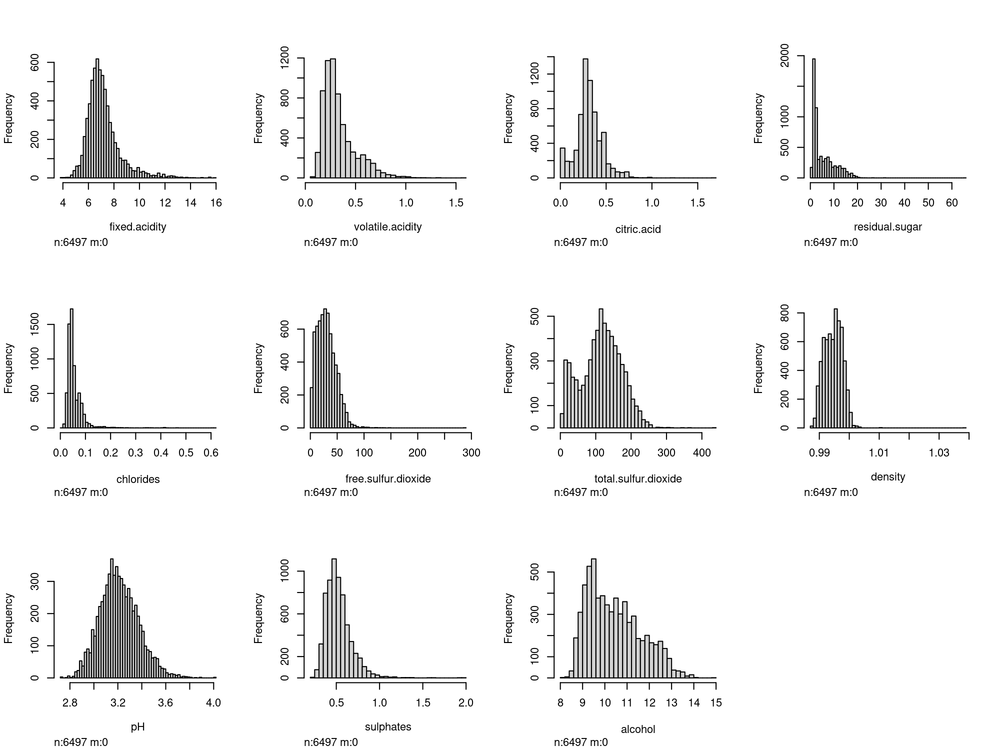

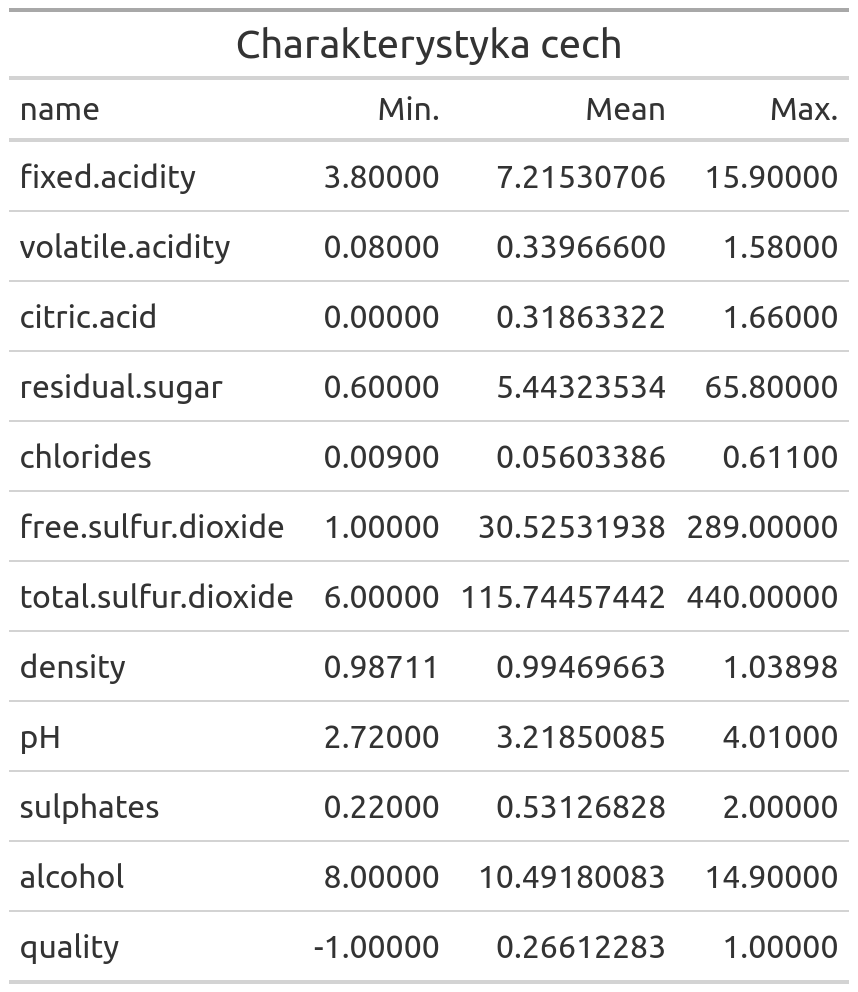

Na podstawie histogramów oraz min/max wartości cech, można stwierdzić iż konieczna będzie standaryzacja wartości - dane mają różne skale, a wszystkie cechy mają rozkład normalny.

Na podstawie tabeli można również stwierdzić, iż rekordów o $y=1$ jest więcej.

<div style="page-break-after: always;"></div>

## Wykres zależności TPR(FPR) dla różnych parametrów

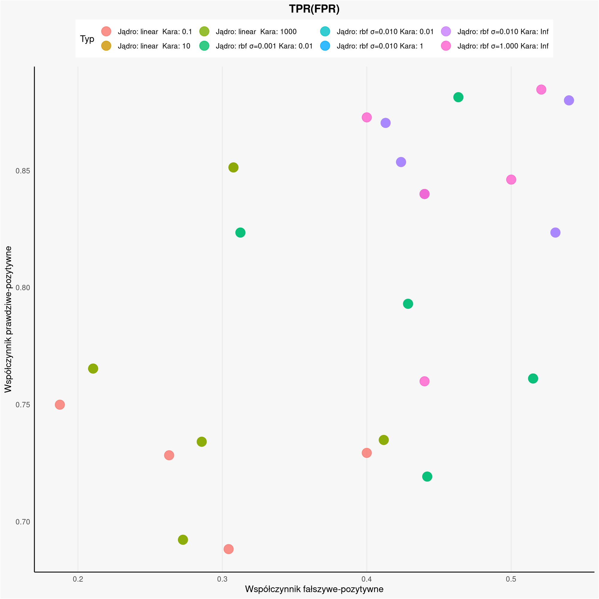

Wykres przedstawia jaki jest stosunek przykładów zaklasyfikowanych poprawnie do błędnie zakfalifikowanych dla klasy o $y=1$. Można zauważyć trend, gdzie wraz z wzrostem FPR rośnie TPR - ze względu na przewagę liczbną klasy 1 algorytm częściej jako odpowiedź zwraca tą klasę.

Na przykładzie wykresu widać również zależność wyników dla jądra rbf od sigmy i kary - wraz z wzrostem tych parametrów maleje lokalność algorytmu, program globalnie stwierdza, że ta klasa się częściej pojawia - rośnie więc TPR, ale także FPR.

Według tego wykresu, najlepszymi modelami są algorytmy, których punkty są położene jak najbliżej lewego-górnego rogu. Według tej klasyfikacji najlepszym algorytmem jest algorytm z jądrem liniowym i karą 1000 lub 0.1 oraz model rbf z sigmą 1e-3 i karą 1e-2.

Przyjmując za próg akceptacji $FPR<0.5$ około 75% uruchomień było prawidowych.

<div style="page-break-after: always;"></div>

## Porównanie najlepszych i najgorszych uruchomień modeli danego typu

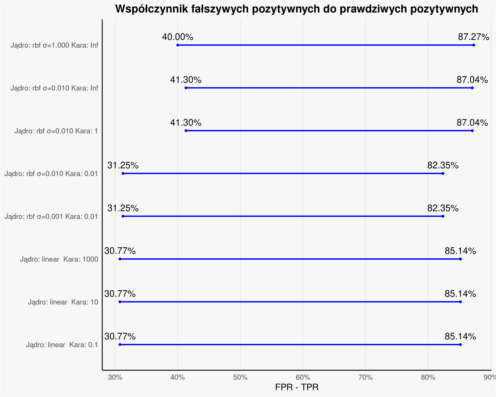

Dla najlepszych uruchomień(wykres jest maksymalnie rozciągnięty - małe FPR, duże TPR) algorytmy tych samych kerneli osiągneły praktycznie takie same wyniki - każdy model znalazł to samo optimum. Algorytmy z liniowym jądrem okazały się lepsze.

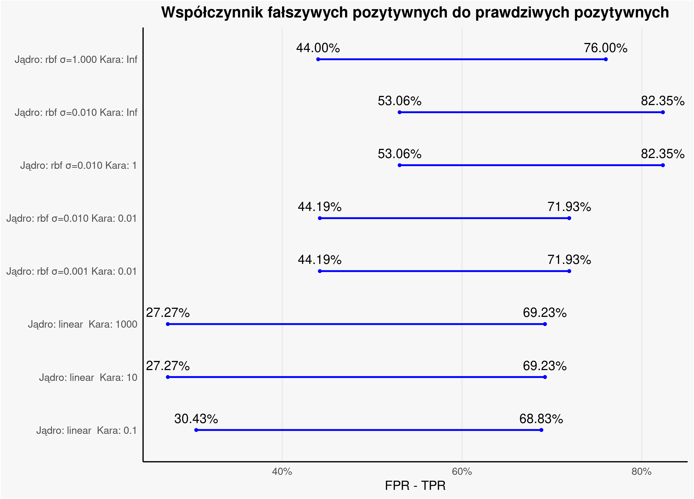

W przypadku najgorszych uruchomień modele z liniowym jądrem osiągnęły mniejszą ilość niepoprawnych klasyfikacji, lecz gorszą ilość poprawnych. Ponownie można zauważyć iż jądro rbf częściej wskazuje klasę 1 jako bardziej prawdopodobną

<div style="page-break-after: always;"></div>

### Najlepsze uruchomienia

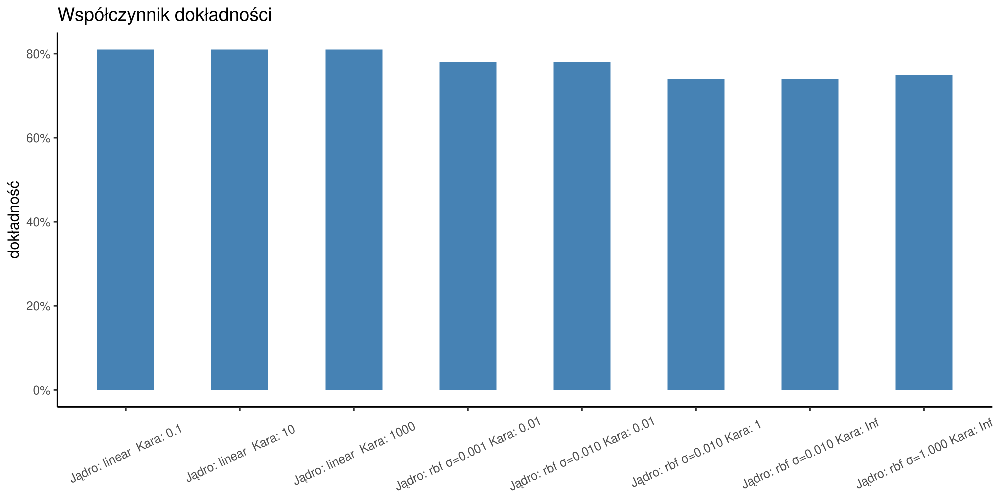

### Najgorsze uruchomienia

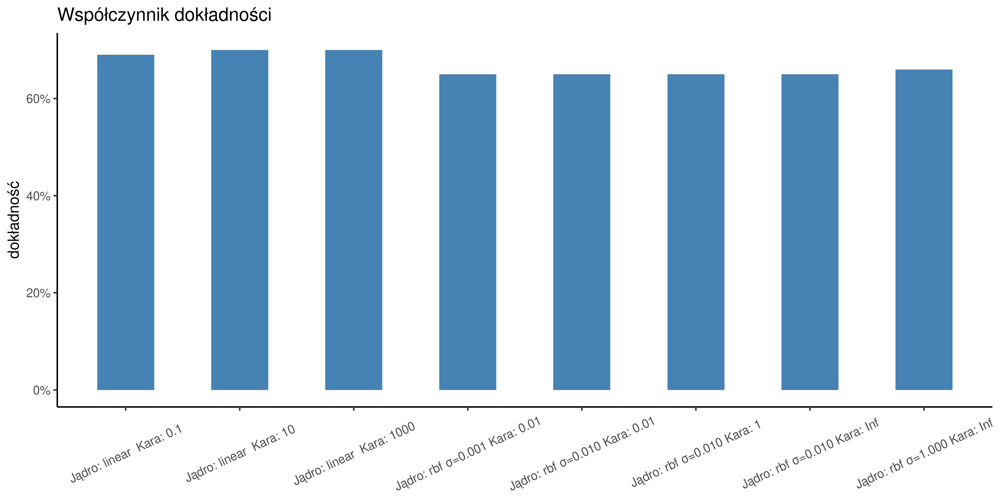

Dokładność wskazuje w ilu przypadkach, bez względu na wartość klasy, model wskazał poprawną odpowiedź. SVM z liniowym jądrem zarówna dla najlepszego jak i najgorszego uruchomienia uzyskał najlepsze wyniki, jednakże można zauważyć iż nie są one znacząco odmienne.

<div style="page-break-after: always;"></div>

## Macierze błędów

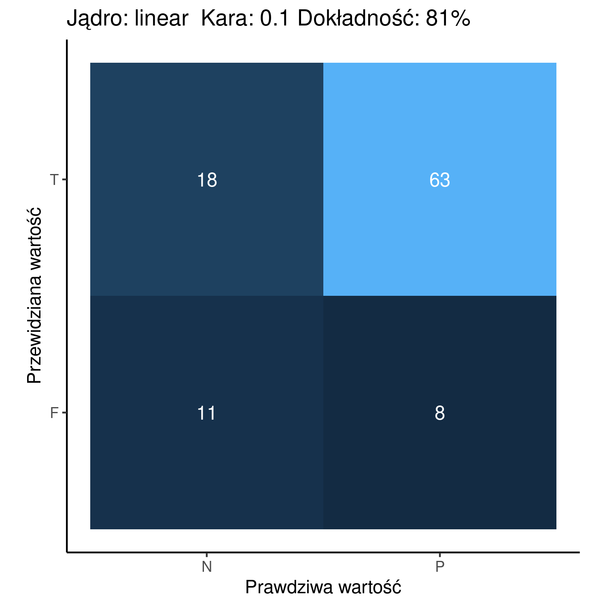

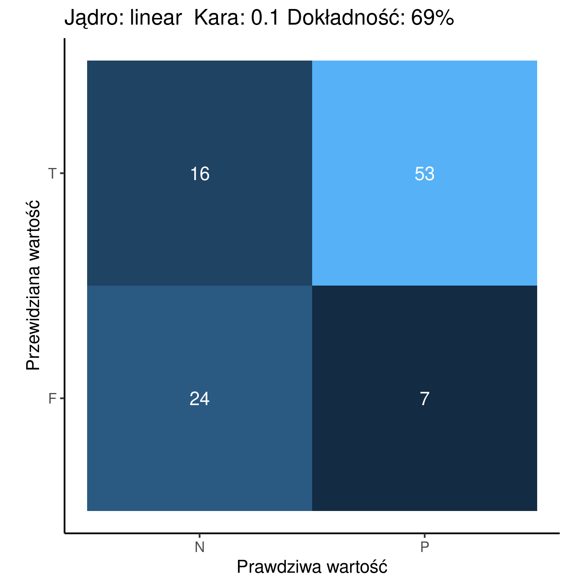

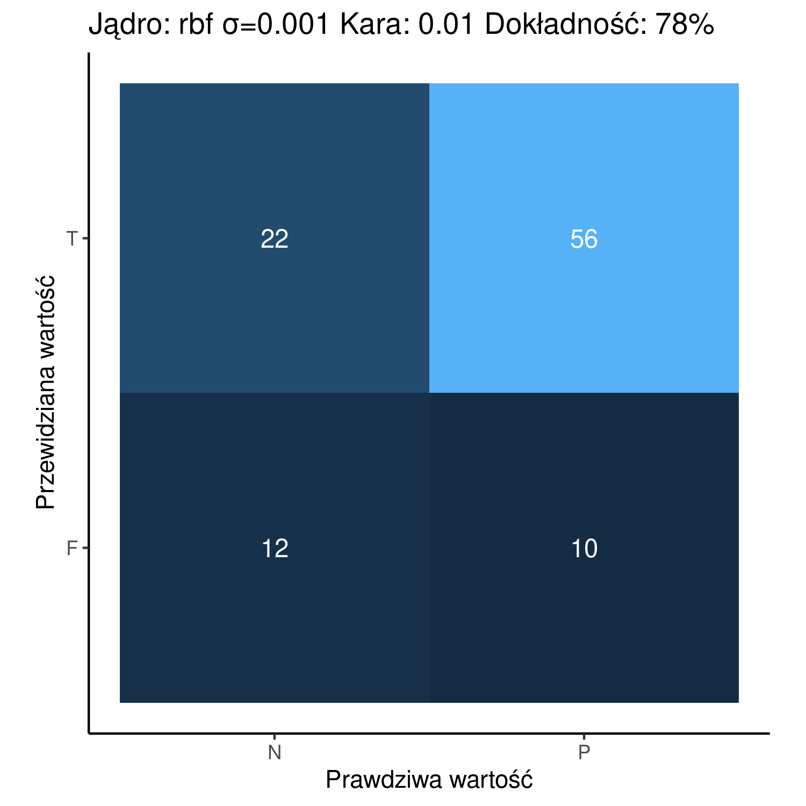

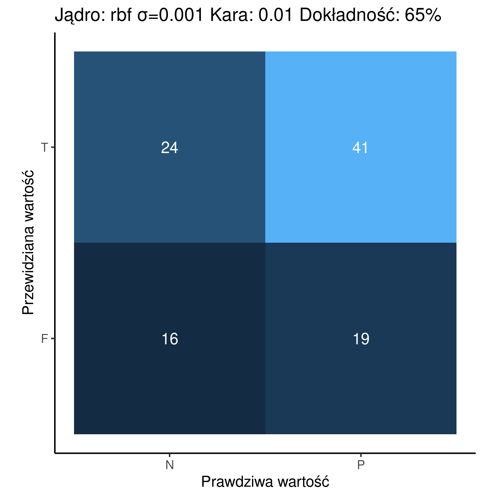

<div style="page-break-after: always;"></div>


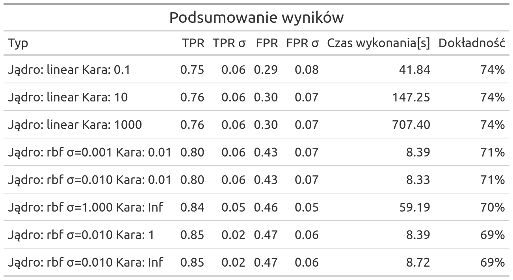

<div style="text-align: justify">
Według tabeli agregującej średnie osiągi każdego z modeli algorytmy z liniowym jądrem osiągały najlepszą dokładność, jednakże rzadziej poprawnie klasyfikowały. Można również zauważyć praktyczny brak wpływy parametru kary na algorytm liniowy, po za czasem wykonania, który pomiędzy $C=0.1$  a $C=1000$ jest aż 18 krotnie większy. Widać również, iż dla jądra rbf algorytm szybciej optymalizował funkcję celu - przez wcześniejsze policzenie macierzy jądra został wykluczony element ciężkości obliczeń iloczynu skalarnego w innych przestrzeniach. SVM z RBF był również szybko optymalizowalny, ponieważ funkcja ma charakter bardziej lokalny, przez co solver może szybko natrafić na odpowiednie miejsce do eksploatacji.
</div>

# Wnioski

<div style="text-align: justify">
Dzięki wielu uruchomieniom tych samych modeli na różnych podzbiorach danych uczących i cross walidacji, można stwierdzić, iż algorytm SVM pozwala na dobre dostosowanie do danych, dzięki możliwości zmiany jądra - pozwala klasyfikować możliwe nieliniowe zależności. Jednakże algorytm w postaci dualnej jest bardzo kosztowny obliczeniowo - każda ewaluacja funkcji celu to wymnożenie macierzy o rozmiarach zbioru uczącego przez kombinację mnożników Lagrange'a. Zauważając, lepsze osiągi algorytmu z jądrem liniowym, oraz praktyczny brak wpływu hiperparametru kary, można stwierdzić, iż zbiór był bliższy separacji liniowej. W przypadku algorytmy z jądrem RBF można zauważyć wpływ hiperparametrów na osiągi oraz czas działania. Mniejsze wartości sigmy i kary zwiększają lokalność rozwiązań, a przez to optymalizator szybciej znajduje optimium lokalne, jednakże może to prowadzić do niesłusznego faworyzowania jednej z klas, zwiększając ilośc niepoprawnie przewidzianych klas z zbioru testowego.
</div>

<script type="text/javascript" src="http://cdn.mathjax.org/mathjax/latest/MathJax.js?config=TeX-AMS-MML_HTMLorMML"></script>
<script type="text/x-mathjax-config"> MathJax.Hub.Config({ tex2jax: {inlineMath: [['$', '$']]}, messageStyle: "none" });</script>